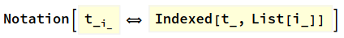
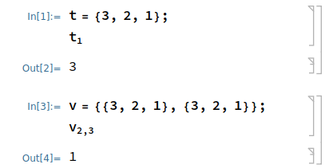

# .Mathematica
My custom mathematica config. This will be used in other Mathematica files in all of my other projects. Clone this in your .Mathematica directory at ```$HOME``` to use it. Can be used for customizing individual projects as well. Please refer to Mathematica Documentation about how to set it up.

## Functions used:
### Subscript as Indexed
Code summary:



Usage:



### Alert using sound after something is done
Code summary:
```
Alert[]:=EmitSound[Sound[SoundNote[]]]
```
Usage:
```
LongCalculation[Expr];Alert[]
```
